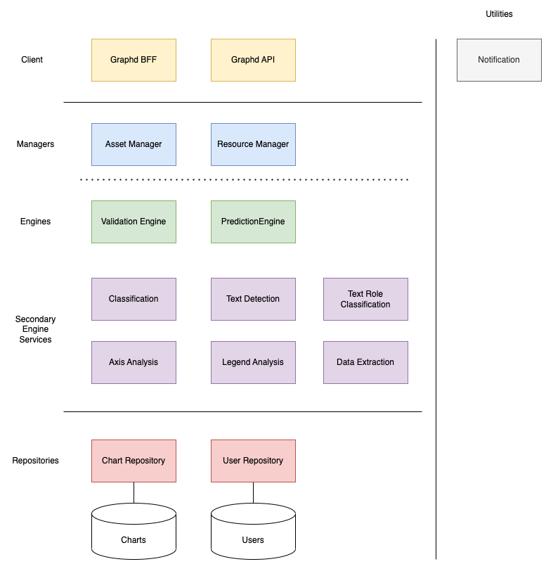

## Graphd Backend
This directory contains all services composing the graphd backend
### Developer Setup
#### Installation
```console
brew install pyenv pyenv-virtualenv docker poetry
pyenv virtualenv 3.11.3 graphd
pyenv activate graphd
```

```console
poetry install
```

#### Databases
```console
docker-compose up -d
```

#### Unit Tests
```console
pytest
```

#### Database Migrations

```console
# https://alembic.sqlalchemy.org/en/latest/tutorial.html
alembic revision --autogenerate -m "msg"
alembic upgrade head
```


# System Design
The Graphd backend architecture implements a modified version of the [iDesign method](https://medium.com/nmc-techblog/software-architecture-with-the-idesign-method-63716a8329ec)

## Volatility Based Decomposition
Extract core use cases — what our system should do (forever and ever)
* Generate datasets from static client assets (first place you took for quantitative data)

Find areas of volatilities — what can change over time (that we should prepare for)
| Volatility | Description | Notes |
|---|---|---|
| HIGH | End-to-end prediction algorithm |  |
| HIGH | Specific prediction algorithms |  |
| HIGH  | Chart type structure |  |
| LOW | Asset type | single chart, multi chart, report, etc. |
|  |  |  |

Define the services that will compose the architecture




## Architecture
### Service Types
* Client — Handles communication with client, no business logic (e.g. REST controller) — who is making the request
* Manager — Orchestrated business use cases, define the workflow — what needs to be done
* Engine — Executes business logic — how to implement an activity
* Repository — encapsulates accessing resources (e.g. DB, REST endpoint) — where do I get data from
* Utility — Cross-cutting concern that is not specific to our business logic (could be used in a coffee machine)

### Rules
Service communication follows "semi-open" rule set

* Flow control only goes from top to bottom (Client → Manager → Engine (optional) → Repository)
* Each Service can access any service, as long as it’s top to bottom
* Manager can call other managers but only by triggering an action (asynchronous)
* Every service can access any utility service
* Each service should be independent (potentially a microservice), this means that for instance, it has to have it’s own business objects
